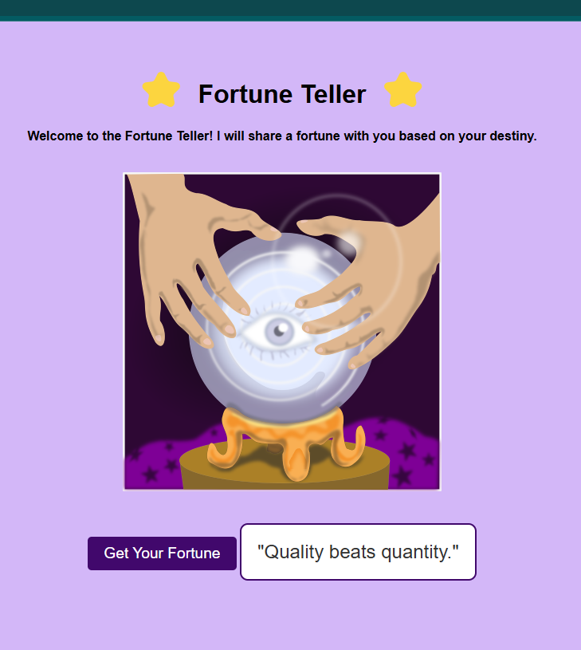

# fortune-teller

Welcome to the **Fortune Teller** project! This web app generates a random fortune for the user each time they click the button. The fortunes are dynamically fetched from an external API, and the app features sound effects and animations for a fun and engaging experience.

## Features

- **Dynamic Fortune Generation**: Fortunes are fetched from an API, ensuring that each fortune is unique and random.
- **Sound Effects**: A mystical sound plays whenever the fortune is revealed.
- **Animation**: A shake animation is applied to the fortune text, making it more interactive.
- **Responsive Design**: The app adjusts to different screen sizes, ensuring a pleasant experience on both desktop and mobile devices.

## Technologies Used

- **HTML5**: For the structure and content of the webpage.
- **CSS3**: For styling and animations.
- **JavaScript**: For dynamic interactions and API integration.

## How It Works

1. **User Interaction**: When the user clicks the "Get Your Fortune" button, a fortune is fetched from an external API (such as [Advice Slip API](https://api.adviceslip.com/)).s
2. **Sound & Animation**: Upon receiving the fortune, the app plays a sound and displays the fortune with a shake animation.
3. **API Integration**: The fortune is fetched in real-time using a `fetch()` request to an external API, so each fortune is random and fresh.
   
## Screenshot

Here’s what the Fortune Teller app looks like:


## How to Run the Project

1. **Clone the repository** to your local machine:
   ```bash
   git clone https://github.com/RusLena/fortune-teller.git

2. Open the index.html file in your browser:
Navigate to the project folder and double-click index.html to open it in your default web browser.
Enjoy the Fortune Teller app:
Click the "Get Your Fortune" button to see a random fortune and hear the sound effect.  


